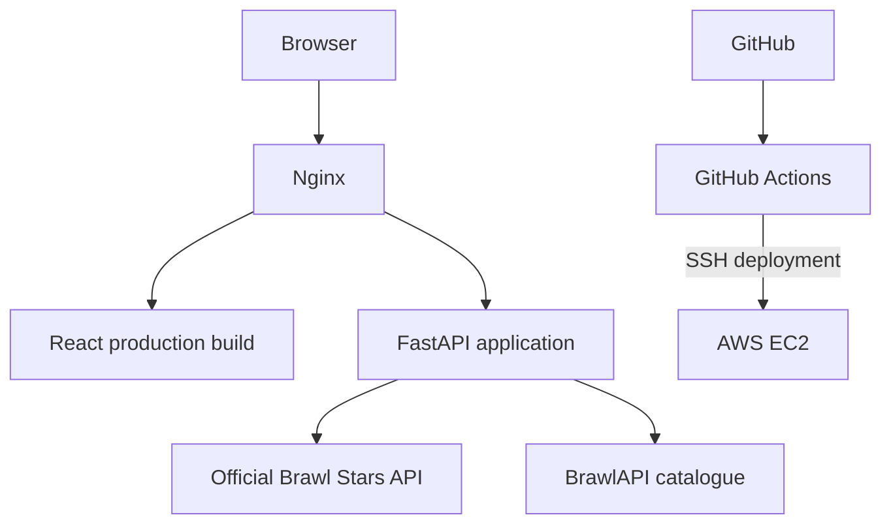

# Brawl Stats

Brawl Stats is a web app for exploring a Brawl Stars player's brawler collection. Enter a player tag to view the player's brawlers, current and highest trophies, power levels, and available equipment information in a searchable, class-grouped gallery.

The frontend is built with React, TypeScript, and Vite. A Python FastAPI backend retrieves player data from the official Brawl Stars API and enriches it with brawler catalogue information from BrawlAPI.

## Features

- Look up a player by tag, with or without the `#` prefix.
- View brawlers split into **1,000+ trophies** and **Below 1,000** categories. A brawler with exactly 1,000 current trophies belongs in the first category.
- Search by brawler name and filter by class.
- View current trophies, highest trophies, power level, and available Star Power, gadget, and gear information.
- Group brawlers by class and sort them by current trophies within each class.
- Cache brawler catalogue metadata for five minutes to reduce repeated requests to the third-party catalogue.
- Deploy the application to AWS EC2 using Nginx, HTTPS, systemd, and GitHub Actions.

## Tech stack

| Area | Technologies |
| --- | --- |
| Frontend | React, TypeScript, Vite |
| Backend | Python, FastAPI, Uvicorn |
| APIs | Official Brawl Stars API, BrawlAPI catalogue |
| Hosting | AWS EC2, Ubuntu |
| Web server and reverse proxy | Nginx |
| Process management | systemd |
| CI/CD | GitHub Actions |
| Security and access | Environment variables, SSH, HTTPS/TLS, AWS Security Groups |

## Architecture



In production, Nginx serves the built frontend and forwards API requests to FastAPI. Uvicorn runs the FastAPI application on the local loopback interface, so the backend does not need to be exposed directly to the public internet. GitHub Actions runs checks for pull requests and pushes; deployment is configured to run on pushes to `main`.

## Project structure

```text
brawl-stats/
├── .github/
│   └── workflows/
│       └── ci.yml
├── backend/
│   ├── .env.example
│   ├── .gitignore
│   ├── main.py
│   └── requirements.txt
├── frontend/
│   ├── src/
│   │   ├── App.tsx
│   │   ├── api.ts
│   │   ├── main.tsx
│   │   ├── styles.css
│   │   └── types.ts
│   ├── index.html
│   ├── package.json
│   ├── package-lock.json
│   ├── tsconfig.json
│   ├── tsconfig.node.json
│   └── vite.config.ts
└── README.md
```

## Run locally

### Requirements

- Python 3.10 or newer
- Node.js 20 or newer and npm
- A Brawl Stars API key from the [official developer portal](https://developer.brawlstars.com/)

### 1. Clone the repository

```bash
git clone https://github.com/irfan5122/brawl-stats.git
cd brawl-stats
```

### 2. Configure the backend

Create and activate a virtual environment:

```bash
cd backend
python -m venv .venv
```

Linux/macOS:

```bash
source .venv/bin/activate
```

Windows PowerShell:

```powershell
.venv\Scripts\Activate.ps1
```

Install the Python dependencies:

```bash
pip install -r requirements.txt
```

Copy `backend/.env.example` to `backend/.env` and set your API key:

```dotenv
BRAWL_STARS_API_KEY=your_api_key_here
FRONTEND_ORIGIN=http://localhost:5173
```

Use your own valid API key. The key's IP allowlist must permit the public IP address of the machine making requests to the official API. Keep the real `.env` file private and never commit API credentials.

Start the backend from the `backend` directory:

```bash
uvicorn main:app --reload --host 127.0.0.1 --port 8000
```

The API documentation is available at [http://127.0.0.1:8000/docs](http://127.0.0.1:8000/docs), and the health endpoint is [http://127.0.0.1:8000/api/health](http://127.0.0.1:8000/api/health).

### 3. Configure and run the frontend

Open a second terminal from the repository root:

```bash
cd frontend
npm ci
npm run dev
```

Open the local URL printed by Vite, usually [http://localhost:5173](http://localhost:5173). The frontend's API configuration and backend CORS origin must match your local setup.

### 4. Build the frontend

From the `frontend` directory:

```bash
npm run build
```

Vite creates the production build in `frontend/dist/`.

## API endpoints

| Method | Endpoint | Purpose |
| --- | --- | --- |
| `GET` | `/api/health` | Check whether the backend is responding |
| `GET` | `/api/player?tag=%23ABC123` | Retrieve player details and brawler statistics for a player tag |

The player endpoint calls the official Brawl Stars API. The backend also uses BrawlAPI for catalogue metadata such as brawler class and image information. If the third-party catalogue is unavailable, player data can still be returned, although some metadata may be marked as unknown or unavailable.

Equipment ownership fields are not inferred when the upstream player response does not provide them. In such cases, the API returns unavailable values instead of assuming that equipment is unlocked.

## CI/CD and deployment

The GitHub Actions workflow in `.github/workflows/ci.yml` is configured to:

1. Run Python syntax checks.
2. Install frontend dependencies and build the React application.
3. On pushes to `main`, connect to EC2 over SSH.
4. Pull the latest code, rebuild the frontend, and install backend dependencies.
5. Restart the FastAPI systemd service, validate and reload Nginx, and check the health endpoint.

The deployment job requires the following GitHub Actions repository secrets to be configured: `EC2_HOST`, `EC2_USER`, and `EC2_SSH_KEY`. Do not store private keys or other credentials directly in the workflow file.

The production setup uses Nginx to serve static frontend files and proxy API traffic to Uvicorn. HTTPS is configured at the web-server layer. AWS Security Groups control which inbound ports are reachable from outside the instance.

## Troubleshooting

Check the backend service on the EC2 instance:

```bash
sudo systemctl status brawl-stats
sudo journalctl -u brawl-stats -n 50 --no-pager
```

Validate Nginx configuration before reloading it:

```bash
sudo nginx -t
sudo systemctl reload nginx
```

If player lookup fails, check that the API key is set in `backend/.env`, that the key's IP allowlist includes the server's current public IP, and that the official API is reachable.

## Security notes

- Never commit `backend/.env`, API keys, or SSH private keys.
- Keep the Brawl Stars API key in the backend; do not expose it in frontend code.
- Keep Uvicorn bound to localhost when Nginx is intended to be the public entry point.
- Restrict SSH access and configure AWS Security Groups to allow only the required inbound traffic.
- Use HTTPS for public browser connections.

## Known limitations

- Player lookups depend on availability and rate limits of the official Brawl Stars API.
- Brawler class and catalogue metadata depend on the third-party BrawlAPI service.
- Equipment information may be unavailable when the upstream player response does not include ownership details.

## Author

**Ahmed Irfan N.**

GitHub: [@irfan5122](https://github.com/irfan5122)

